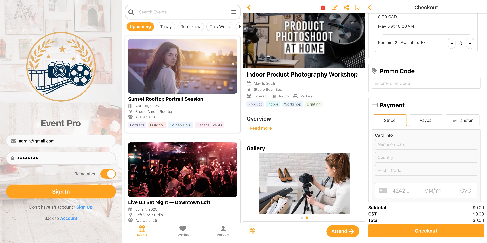

# Photography and Music Studio
A full stack project. View the `./web`, `./mobile`, and `./backend` folder for getting more detail!

**Web**

    

Click [Here](https://studio-website-topaz.vercel.app/) to check out my studio website!  
The studio website built by `NEXT.js`, `Typescript`, `SCSS`, and `Vercel`. 

**Mobile**

    

Click [Here](https://youtu.be/GS5UGwSru4s) to check out my app demo!  
The studio App built by `React Native`, `Typescript`, `Node.js`, `Firebase`, and `Vercel` for event regiteration.

## Project Architecture

    

