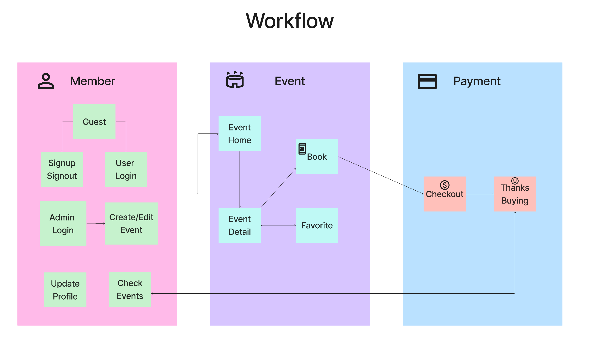

# Studio Back-end

## Introduction
<div align="center">
    
</div>

This repository contains the `Node.js` back‑end API for the project. <br>
It is built with `Express` and integrates with `Firebase` Admin SDK to interact with multiple Firestore databases. The `API` provides endpoints for user authentication, event management, favorites, order processing, coupon handling, and more.

## Features

- **User Authentication**:  
  - Sign in, sign up, and sign out endpoints that use `Firebase` Authentication.
  - Secure token validation with middleware.
- **Event Management**:  
  - `CRUD` operations for events.
  - Endpoints to manage sessions within events.
  - Admin-only functionalities (create, edit, delete events).
- **Favorites**:  
  - Endpoints for adding, deleting (single and batch), and fetching user favorite events.
- **Order Processing**:  
  - Checkout API that handles ticket purchases.
  - Integration with various payment methods (Stripe, PayPal, E‑Transfer).
  - Coupon validation and discount calculation (by fixed value or percentage).
  - Generation of QR codes for tickets.
- **Multi‑database Architecture**:  
  - Uses separate `Firestore` databases (via different initialization apps) for account data and event data.

## Code Structure

- **Express Routes**:  
  - Organized into separate routers for authentication (`/auth`), events (`/events`), favorites (`/favorites`), and orders.
- **Firebase Integration**:  
  - Uses `Firebase` Admin SDK with custom initialization for different databases.
  - Implements transactions for critical operations such as ticket booking and coupon deduction.
- **Middleware**:  
  - Authentication token verification.
  - Role‑based authorization (e.g., Admin check).

## Data Model Overview

### Key Collections

- **account**:  
  - Fields: `uid`, `email`, `displayName`, `phoneNumber`, `pictureURL`, `role`, `createAt`, `updateAt`, `lastLogin`.
- **event**:  
  - Fields: `id`, `name`, `host`, `session` (array of objects with `sessionID`, `startDate`, `endDate`, `price`, `remain`, `available`, `type`), `location` (object with `name` and `address`), `notice`, `tags`, `eventDetail` (HTML), `imagesURL`, `createUser`, `logUser`, `updateAt`.
- **favorite**:  
  - Fields: `id`, `accountID`, `eventID`, `createAt`.
- **coupon**:  
  - Fields: `id`, `code`, `quantity`, `type` (value or percentage), `amount`.
- **eventOrder**:  
  - Fields: `id`, `eventID`, `accountID`, `couponID`, `subtotal`, `GST`, `discountAmount`, `total`, `updateAt`.
  - Subcollection `ticket` for each ticket document: `id`, `sessionID`, `accountID`, `createdAt`, and `QRCode` (constructed as "ticketID+++sessionID").

## Getting Started

1. **Installation**:  
   - Clone the repository and install dependencies:
     ```bash
     npm install
     ```
2. **Configuration**:  
   - Set up your Firebase service account keys and configure your environment variables (`.env`).
    ```
    # The Step to Generate Private Key from Firebase
    -> Project home page 
    -> Add app 
    -> Choose WEB Service 
    -> Register your APP and get the private key in JSON format
    -> Put the JSON file to path ./key
    -> Open the terminal and `cd key`
    -> Enter the `base64 -i path/to/firebaseAuth.json`
    -> Get the private key(connection string)
    -> Put the string to `.env`
    ```
    
3. **`.env` Setting Parameter**:
    ```
    DB_DEFAULT_PORT=Port
    FIREBASE_AUTH_B64=AuthFirebasePrivateKey
    FIREBASE_EVENT_B64=EventFirebasePrivateKey
    ```
4. **For Testing Auth and Event Database Connection**:
    ```
    npm run test:firebase
    ```

5. **Inserting the MockData into Event Database**:
    ```
    npm run test:insertMock
    ```

6. **Running the Server**:
    ```bash
    npm start
    ```
7. **Notice**: <br>
Signup from frontend system. Atfer that, manually update the `role` field  to 'Admin' from account collection at Account database(For adding/editing event privlege)

8. **Enjoy!**

## API Endpoints

- **Authentication**:
  - `POST /auth/signup`: Register a new user.
  - `POST /auth/login`: Login (with Firebase Authentication).
  - `POST /auth/logout`: Logout.
- **Event Management**:
  - `GET /events`: Retrieve all events.
  - `POST /events/dataEdit`: Add a new event.
  - `PUT /events/dataEdit/:id`: Edit an existing event.
  - `DELETE /events/dataEdit/:id`: Delete an event.
- **Favorites**:
  - `GET /favorites/:accountID`: Get favorites by user.
  - `POST /favorites`: Add a favorite.
  - `DELETE /favorites`: Batch delete favorites.
  - `DELETE /favorites/:favoriteID`: Delete a single favorite.
- **Orders & Tickets**:
  - `POST /events/eventOrder`: Create an order (with coupon and ticket processing).
  - `GET /events/eventOrderDetail/:orderID`: Get order details (including ticket QR codes).
