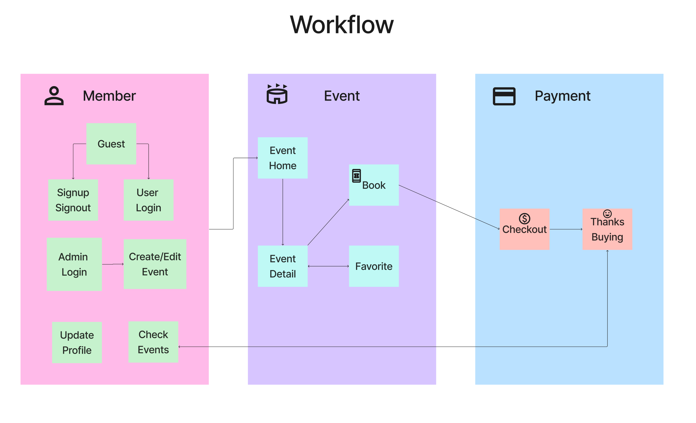

# Studio Mobile App for Event Registeration

## Introduction
<div align="center">
    
</div>

Click [Here](https://youtu.be/GS5UGwSru4s) to check out my app demo! <br>
This repository contains the `React Native` front‑end for event registeration. <br>
It is built with `TypeScript`, `React Native`, and integrates with `Firebase` Authentication and a `Node.js` back‑end via `RESTful API`.

## Features
<div align="center">
    
</div>

- **Event Listing & Search**: Browse and filter events using keywords, date options, tags, and notice filters.
- **Event Detail**: View event information, including images (with gallery and fallback support), event description (rich HTML rendered), session timings, and location details with an interactive map.
- **Favorites**: Add or remove events from favorites; batch delete mode available.
- **Account Management**: Sign in, sign up, update profile, and view user-specific event orders.
- **Checkout & Order**: Register for event sessions with various payment options (Stripe, PayPal, E‑Transfer), coupon validation, and QR code generation for tickets.
- **Admin Panel**: Admin users can create, edit, and delete events using a dedicated editing screen with date pickers, dropdown selectors, rich text editor, and more.
- **Multi‑database Architecture**: Uses Firestore multi‑database architecture to separate event data, account data, and other micro‑services.

## Code Structure

- **Navigation Stacks**:  
  - `EventStackScreen`: Handles event listing, event details, checkout, and thank you screens.  
  - `FavoriteStackScreen`: Handles the favorites feature.  
  - `AccountStackScreen`: Manages account-related screens (sign‑in, sign‑up, update profile, user events, etc.).

- **Main Components**:  
  - `SearchBar`: Custom search bar with filtering options (tags, date options, notice selections).  
  - `EventCard`: Displays a summary of event information (image, name, date, location, tags).  
  - `SearchAndEventCard`: Integrates search functionality with event card listing.
  - Other components include QR code generators, rich text editors, and session forms.

## Data Model Overview

### Key Collections (Managed on the Back-end)
- **account**: User profiles with fields like `uid`, `email`, `displayName`, `phoneNumber`, `pictureURL`, and `role`.
- **event**: Events with details such as `name`, `session` (each session includes `sessionID`, `startDate`, `endDate`, `price`, `remain`, `available`, `type`), `location` (name and address), `notice` (booleans for in-person, indoor, etc.), `tags`, `eventDetail` (HTML), and `imagesURL`.
- **favorite**: Favorite events linked to a user.
- **eventOrder**: Order documents storing ticket purchases, with subcollection `ticket` for each ticket, coupon and discount details, and price breakdown (subtotal, GST, total).

## Getting Started

1. **Installation**:  
   - Clone the repository and install dependencies:
     ```bash
     npm install
     ```
2. **Configuration**:  
   - Configure your Firebase and API endpoints in `.env`
     ```
     API_BASE_URL=YourBackendURL(Local,AWS,GCP,Azure,Vercel....)
     STRIPE_PK_KEY=YourPaymentMethod
     FIREBASE_AUTH_API_KEY=ConfigFromFirebase
     FIREBASE_AUTH_AUTH_DOMAIN=ConfigFromFirebase
     FIREBASE_AUTH_PROJECTID=ConfigFromFirebase
     FIREBASE_AUTH_STORAGEBUCKET=ConfigFromFirebase
     FIREBASE_AUTH_MESSAGINGSENDERID=ConfigFromFirebase
     FIREBASE_AUTH_APPID=ConfigFromFirebase
     FIREBASE_AUTH_MEASUREMENTID=ConfigFromFirebase
     TEST=ForYourTesting
     ```
    
3. **Running the App**:  
   - Run the app on your device or simulator:
     ```bash
     # recommend
     npx expo start --tunnel
     # or
     npx react-native run-ios
     # or
     npx react-native run-android
     
     ```


